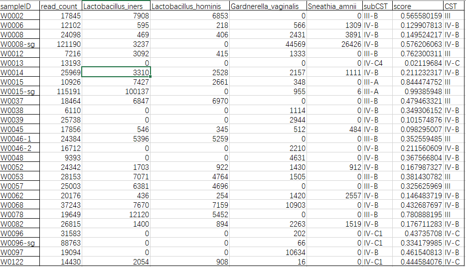
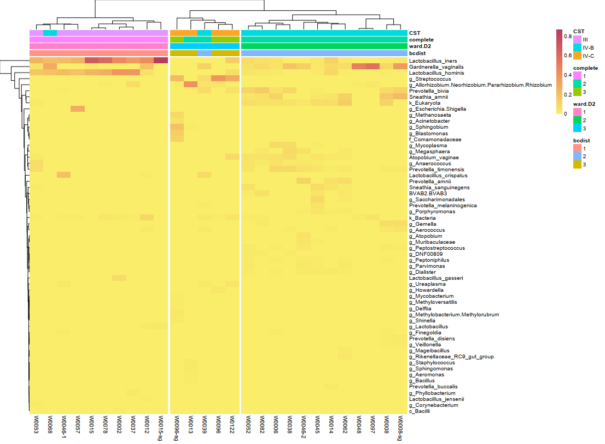
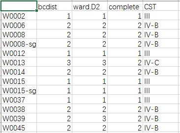

# BV-CSTs

本脚本结合Valencia方法用于对阴道炎微生物菌群的CSTs分型

### 依赖的R包：

- <div>

  > - argparse
  > - pheatmap
  > - cowplot
  > - ggplot2
  > - grid
  > - readxl
  > - dplyr
  > - ecodist
  >

  </div>

### 输入文件：

Valencia分析的矩阵分析后的矩阵，如：

- 行名为样本名。
- 列名包括read count总数、菌群read数、Valencia分类结果等。



### 使用方法：

```r
[soda]:Rscript.exe R.R --help 
usage: R.R [-h] [--f1 F1] [--fc FC] 用BV-CSTs分型聚类，可以同时进行多种不同的聚类方法
options: 
-h, --help  show this help message and exit 
--f1 F1     输入Valencia分析的矩阵。矩阵格式：横列为样本，纵列为菌群名，数值为read数目，具体格式见README
--fc FC     过滤标准，样本中的菌群占比低于该标准的会被过滤掉，默认是0.01
```

### 输出结果：

#### BV-CSTs.pdf：



#### 一致性.csv


